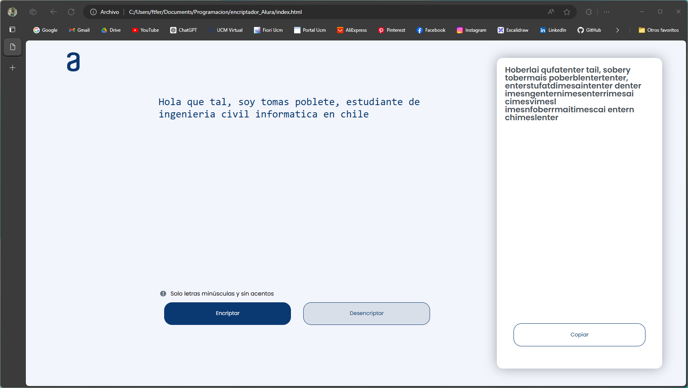
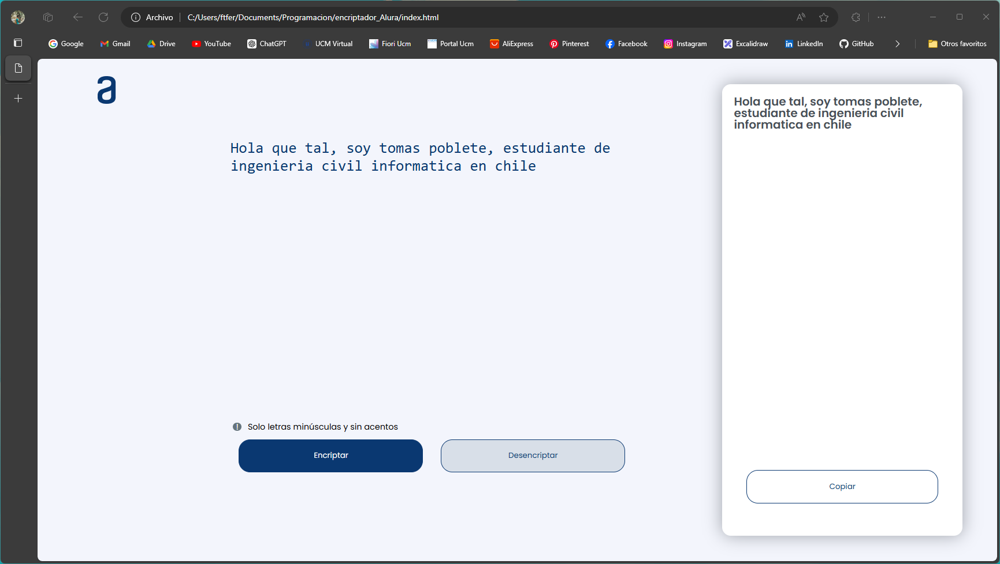

# Encriptador de Texto

Este proyecto es una aplicación web sencilla que permite codificar y decodificar mensajes de texto utilizando un esquema específico. El propósito principal es aplicar conceptos básicos de HTML, CSS y JavaScript para crear una interfaz de usuario interactiva. Este es un desafio hecho para el G7 Alura Latam en el Programa ONE (ORACLE NEXT EDUCATION)

## Características

- **Codificación de Mensajes:** Transforma los caracteres vocales en una secuencia específica.
- **Decodificación de Mensajes:** Reconvierte la secuencia codificada a su forma original.
- **Interfaz Amigable:** Permite copiar el texto codificado o decodificado al portapapeles.
- **Diseño Responsivo:** La aplicación se adapta a diferentes tamaños de pantalla.

## Tecnologías Utilizadas

- **HTML5**: Estructura de la página web.
- **CSS3**: Estilización de la página con enfoque en diseño responsivo.
- **JavaScript**: Lógica para codificar y decodificar el texto, así como para interactuar con el DOM.

## Capturas de Pantalla

### Vista Principal


### Codificación de Texto



### Decodificación de Texto



## Cómo Usar

1. **Clonar el Repositorio:**

   ```bash
   git clone https://github.com/tu_usuario/decodificador-texto.git
